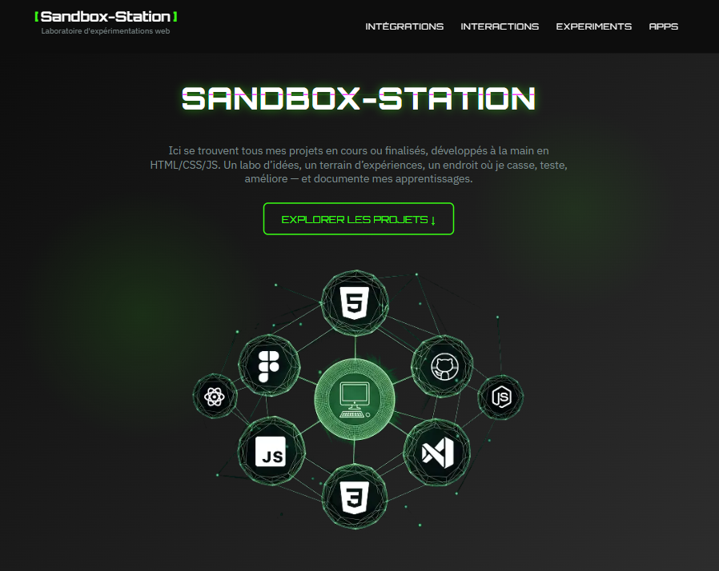

<div align="center">
  <h1>🧪 Sandbox-Station</h1>
  <p>📂 Interface terminal pour explorer mes projets web</p>

  <p align="center">
    
    
    
    
  </p>

  <p>
    <a href="https://jhauck67.github.io/Sandbox-Station/">🚀 Accéder à Sandbox-Station</a> •
    <a href="#-présentation">Présentation</a> •
    <a href="#-autrice">À propos</a>
  </p>

  
</div>

---

## 🧩 Présentation

**Sandbox-Station** est un mini-dashboard. Il me sert à regrouper, visualiser et documenter mes projets frontend, dans une interface stylisée et responsive.

> Objectif : Centraliser mes explorations HTML/CSS/JS, avec un rendu clair, accessible et un zeste de personnalité 💻✨  
> Contexte : Projet personnel issu de ma progression en développement web.

---

## 🧰 Stack et structure

- HTML5 sémantique
- CSS (architecture modulaire avec variables)
- Interface responsive multi-plateforme (tests iOS inclus)
- Comportements adaptatifs (tactile / desktop)
- Organisation des projets en cartes (template projet réutilisable)
- Gestion dynamique des cartes, du burger menu et de l'année en pied de page

---

## 🚧 À améliorer

- ♿ Accessibilité des couleurs & contrastes
- 📱 Media queries spécifiques tactile (désactivation du hover)
- 📦 Filtrage interactif des projets (JS en cours d’exploration)

---

## ✅ Ce que j’ai appris

- Mettre en place une UI cohérente et thématisée
- Structurer des composants visuels réutilisables
- Réfléchir à l’expérience utilisateur (navigation + lisibilité)
- Tester sur plusieurs devices + optimiser les performances
- Intégrer et manipuler le DOM avec Javascript

---

## 👩‍💻 Autrice

```bash
> jhauck67
> Apprentie développeuse web
> github.com/jhauck67
```
<p align="center"> <em>Merci pour la visite !<br> 🚦 Prochaine étape : l’automatisation, la modularité... et encore plus de projets !</em> </p>
<div align="center"> <p> <a href="https://github.com/jhauck67">GitHub</a> • <a href="https://jhauck67.github.io/jhauck67/">Portfolio</a> • <a href="https://codepen.io/jhauck67">Codepen</a> </p> </div>