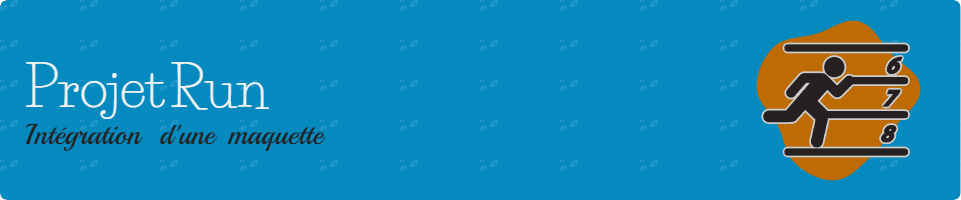

         
    
\

   
\


# Description

Run est une landing page immersive conçue autour d’un concept simple : remettre le mouvement au cœur du quotidien. À travers un design épuré, des visuels inspirants et un ton poétique, ce projet invite l’utilisateur·rice à se reconnecter à soi-même et à la nature, foulée après foulée.

L’objectif était de travailler l'intégration responsive d'une maquette orientée bien-être et dynamisme, tout en optimisant le SEO et l'expérience utilisateur.

## Technologies utilisées :

-  HTML 5
-  CSS 3
-  SASS
-  GIT
-  GitHub Pages

# Fonctionnalités :

- 🖥️ **Version Desktop** : Mise en place de la version pour les écrans de taille standard et grande taille.
- 📱 **Version Mobile** : Adaptation de la maquette pour les petits écrans (smartphones).
- 🔎 **Optimisation SEO** : Travail sur la structure du site pour le rendre plus visible dans les moteurs de recherche.
- 🖼️ **Optimisation des images** : Toutes les images ont été redimensionnées, reformattées et compressées pour un meilleur temps de chargement et une efficacité maximale.

# Détails du code :

Le code a été structuré pour être facile à maintenir et à développer.

- **SASS** est utilisé pour la gestion des styles, permettant une hiérarchisation claire et une réutilisation efficace des styles grâce à des variables, des mixins et des partials.

## Structure du projet :

```plaintext
/ (root)
│
├── index.html              # Page principale du site
├── assets                  # Dossier pour les images, polices, maquettes, styles
│   ├── fonts/              # Dossier pour les polices
│   ├── img/                # Dossier pour les images
│   ├── sketch/             # Dossier pour les maquettes
│   ├── styles/             # Dossier contenant les fichiers CSS et SASS
│   │   ├── components/     # Dossier pour les styles des composants
│   │   ├── layouts/        # Dossier pour les styles de mise en page
│   │   ├── _settings.scss  # Styles de base (typographie, variables)
│   │   ├── index.css       # Fichier principal CSS généré depuis SASS
│   │   ├── index.scss      # Fichier principal SASS
├── readme.md               # Documentation du projet
├── .gitignore              # Fichier gitignore
├── LICENSE                 # Fichier License
```

# Aperçu

Voici un aperçu du projet, que tu peux visualiser en ligne sur GitHub Pages :


## Lien vers le site en ligne

Tu peux consulter la version en ligne de ce projet via GitHub Pages en cliquant sur le lien suivant :
[Voir le site sur GitHub Pages](https://jhauck67.github.io/Projet-Run/)

# Tests et vérifications

## Tests fonctionnels et visuels

### 📱Responsive design

| Catégorie            | Test                                                             | Mobile (iPhone 12)                                                                                                                                                                                                                                                                                                                                                                                                                                                            | Tablet (iPad Air 4)                                                                                                                                                                                                                                                                                                                                                                                                                                                           | Desktop (HP Envy x360)                                                                                                                                                                                                                                                                                                                                    | Observations |
| -------------------- | ---------------------------------------------------------------- | ----------------------------------------------------------------------------------------------------------------------------------------------------------------------------------------------------------------------------------------------------------------------------------------------------------------------------------------------------------------------------------------------------------------------------------------------------------------------------- | ----------------------------------------------------------------------------------------------------------------------------------------------------------------------------------------------------------------------------------------------------------------------------------------------------------------------------------------------------------------------------------------------------------------------------------------------------------------------------- | --------------------------------------------------------------------------------------------------------------------------------------------------------------------------------------------------------------------------------------------------------------------------------------------------------------------------------------------------------- | ------------ |
| Affichage responsive | Vérification du bon affichage du layout (header, grille, marges) |     |     |    | *ras* |
| Menu burger          | Test de l'ouverture/fermeture du menu responsive                 |     |     |    | *pas de burger menu de prévu* |
| Orientation écran    | Adaptation du contenu au passage portrait/paysage                |     |     |    | *ras* |
| Police & Lisibilité  | Vérification de la taille, le contraste et la lisibilité         |     |     |    | *ras* |

### 🧭Navigation et interactions

| Catégorie          | Test                                                    | Mobile (iPhone 12)                                                                                                                                                                                                                                                                                                                                                                                                                                                            | Tablet (iPad Air 4)                                                                                                                                                                                                                                                                                                                                                                                                                                                           | Desktop (HP Envy x360)                                                                                                                                                                                                                                                                                                                                    | Observations |
| ------------------ | ------------------------------------------------------- | ----------------------------------------------------------------------------------------------------------------------------------------------------------------------------------------------------------------------------------------------------------------------------------------------------------------------------------------------------------------------------------------------------------------------------------------------------------------------------- | ----------------------------------------------------------------------------------------------------------------------------------------------------------------------------------------------------------------------------------------------------------------------------------------------------------------------------------------------------------------------------------------------------------------------------------------------------------------------------- | --------------------------------------------------------------------------------------------------------------------------------------------------------------------------------------------------------------------------------------------------------------------------------------------------------------------------------------------------------- | ------------ |
| Navigation tactile | Vérification des zones cliquables (liens, boutons)      |     |     |    | *ras* |
| Liens internes     | Vérification que tous les liens mènent aux bonnes pages |     |     |    | *ras* |

### 🔲Formulaire

| Catégorie   | Test                                             | Mobile (iPhone 12)                                                                                                                                                                                                                                                                                                                                                                                                                                                            | Tablet (iPad Air 4)                                                                                                                                                                                                                                                                                                                                                                                                                                                           | Desktop (HP Envy x360)                                                                                                                                                                                                                                                                                                                                    | Observations |
| ----------- | ------------------------------------------------ | ----------------------------------------------------------------------------------------------------------------------------------------------------------------------------------------------------------------------------------------------------------------------------------------------------------------------------------------------------------------------------------------------------------------------------------------------------------------------------- | ----------------------------------------------------------------------------------------------------------------------------------------------------------------------------------------------------------------------------------------------------------------------------------------------------------------------------------------------------------------------------------------------------------------------------------------------------------------------------- | --------------------------------------------------------------------------------------------------------------------------------------------------------------------------------------------------------------------------------------------------------------------------------------------------------------------------------------------------------- | ------------ |
| Formulaires | Tests des inputs, validations, auto-remplissages |     |     |    | *ras* |

### 🕶️Mode sombre (si disponible)

| Catégorie              | Test                                         | Mobile (iPhone 12)                                                                                                                                                                                                                                                                                                                                                                                                                                                            | Tablet (iPad Air 4)                                                                                                                                                                                                                                                                                                                                                                                                                                                           | Desktop (HP Envy x360)                                                                                                                                                                                                                                                                                                                                    | Observations |
| ---------------------- | -------------------------------------------- | ----------------------------------------------------------------------------------------------------------------------------------------------------------------------------------------------------------------------------------------------------------------------------------------------------------------------------------------------------------------------------------------------------------------------------------------------------------------------------- | ----------------------------------------------------------------------------------------------------------------------------------------------------------------------------------------------------------------------------------------------------------------------------------------------------------------------------------------------------------------------------------------------------------------------------------------------------------------------------- | --------------------------------------------------------------------------------------------------------------------------------------------------------------------------------------------------------------------------------------------------------------------------------------------------------------------------------------------------------- | ------------ |
| Mode sombre (si dispo) | Vérification du bon affichage en mode sombre |     |     |    | *pas de mode sombre prévu* |

## Tests SEO et Accessibilité

### #️⃣Balises `<meta>` et sémantiques

| Catégorie                       | Test                                                             | Mobile (iPhone 12)                                                                                                                                                                                                                                                                                                                                                                                                                                                            | Tablet (iPad Air 4)                                                                                                                                                                                                                                                                                                                                                                                                                                                           | Desktop (HP Envy x360)                                                                                                                                                                                                                                                                                                                                    | Observations |
| ------------------------------- | ---------------------------------------------------------------- | ----------------------------------------------------------------------------------------------------------------------------------------------------------------------------------------------------------------------------------------------------------------------------------------------------------------------------------------------------------------------------------------------------------------------------------------------------------------------------- | ----------------------------------------------------------------------------------------------------------------------------------------------------------------------------------------------------------------------------------------------------------------------------------------------------------------------------------------------------------------------------------------------------------------------------------------------------------------------------- | --------------------------------------------------------------------------------------------------------------------------------------------------------------------------------------------------------------------------------------------------------------------------------------------------------------------------------------------------------- | ------------ |
| SEO mobile                      | Vérification de la présence de la balise`<meta name="viewport">` |     |     |    | *ras* |
| Favicon                         | Vérification de la présence du favicon dans l'onglet             |     |     |    | *ras*             |
| Balises sémantique              | Inspecter le code HTML                                           |                                                                                                                                                                                                                                                                                                                                                                                                                                                                              |                                                                                                                                                                                                                                                                                                                                                                                                                                                                               | [W3C validator HTML](https://validator.w3.org/#validate_by_input)                                                                                                                                                                                                                                                                                         | *ras*             |
| PWA / Ajout à l'écran d'accueil | Si c'est un site PWA, test de l'installation                     |     |     |    | *ras*             |

### 🖼️Optimisation des images

| Catégorie          | Test                                                             | Mobile (iPhone 12)                                                                                                                                                                                                                                                                                                                                                                                                                                                            | Tablet (iPad Air 4)                                                                                                                                                                                                                                                                                                                                                                                                                                                           | Desktop (HP Envy x360)                                                                                                                                                                                                                                                                                                                                    | Observations |
| ------------------ | ---------------------------------------------------------------- | ----------------------------------------------------------------------------------------------------------------------------------------------------------------------------------------------------------------------------------------------------------------------------------------------------------------------------------------------------------------------------------------------------------------------------------------------------------------------------- | ----------------------------------------------------------------------------------------------------------------------------------------------------------------------------------------------------------------------------------------------------------------------------------------------------------------------------------------------------------------------------------------------------------------------------------------------------------------------------- | --------------------------------------------------------------------------------------------------------------------------------------------------------------------------------------------------------------------------------------------------------------------------------------------------------------------------------------------------------- | ------------ |
| Performance        | Observer les temps de chargements du site                        |     |     |    | *ras*             |
| Optimisation image | Test du chargement et de l'apparence des images (qualité, délai) |     |     |    | *ras*             |

### :accessibility:Accessibilité

| Catégorie            | Test                                                                      | Mobile (iPhone 12) | Tablet (iPad Air 4) | Desktop (HP Envy x360)           | Observations |
| -------------------- | ------------------------------------------------------------------------- | ------------------ | ------------------- | -------------------------------- | ------------ |
| Accessibilité (a11y) | Vérification des attributs `alt`, les `aria-label`, la navigation clavier |                    |                     | [WAVE](https://wave.webaim.org/) | Test WAVE ok |

### 🧪Audit SEO

| Catégorie        | Test                                     | Mobile (iPhone 12) | Tablet (iPad Air 4) | Desktop (HP Envy x360)        | Observations |
| ---------------- | ---------------------------------------- | ------------------ | ------------------- | ----------------------------- | ------------ |
| Audit Lighthouse | Lancer un audit Lighthouse depuis Chrome |                    |                     | Lighthouse (extension chrome) |  |

# Audit Lighthouse 

Le projet a été audité à l'aide de Lighthouse pour évaluer ses performances, son accessibilité, ses bonnes pratiques et son SEO. Voici les résultats :

## Performances 

First Contentful Paint   
\
Largest Contentful Paint   
\
Total Blocking Time   
\
Cumulative Layout Shift   
\
Speed Index 
\
\
Ce score reflète la rapidité d’affichage et de réactivité du site. Un score de 95 indique un site fluide, avec un bon temps de chargement et une optimisation efficace des ressources. Quelques optimisations supplémentaires (comme la mise en cache de certaines ressources) pourraient permettre d’atteindre le score parfait.

## Accessibilité 

Le site respecte l’ensemble des bonnes pratiques en matière d’accessibilité : navigation clavier, structure logique du contenu, contraste suffisant… Cela garantit une meilleure expérience pour tous les utilisateurs, y compris ceux utilisant des technologies d’assistance.

## Bonnes pratiques 

Le code est sécurisé, moderne et respecte les standards du web (HTTPS, absence d’erreurs JavaScript, règles de sécurité applicables comme HSTS, XFO, etc.). Cela montre un développement rigoureux et fiable.

## SEO 

Le site est bien optimisé pour le référencement naturel (Search Engine Optimization) : titres bien définis, balises méta présentes, bonnes pratiques techniques respectées. Cela améliore sa visibilité sur les moteurs de recherche.

# Auteur :

Jhauck67 (Développeuse web)

# Liens utiles :

[Portfolio de Jennifer](https://jhauck67.github.io/jenniferhauck/index.html)  
[Voir le site en ligne](https://jhauck67.github.io/Projet-Gaming-Campus/)
